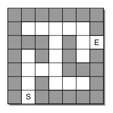

# maze
Given  a  maze  with  indicated  starting  and  exit  positions,  the  objectives  are  determine if there is a path from the starting position to the exit, and specifythe path with no circles or loopbacks.  In designing an algorithm to solve a maze,it will be easier if we think of the maze as a collection of equal-sized cells laid outin  rows  and  columns.   The  cells  will  either  be  filledrepresenting walls of the maze or empty to represent open spaces.  In addition, onecell will be indicated as the starting position and another as the exit.

## Usage
~~~Python
>>> maze = buildMaze("mazefile.txt")
>>> print(maze)
* * * * * 
* _ * _ * 
* _ _ _ * 
* _ * _ _ 
_ _ * * * 
>>> maze.findPath()
True
>>> print(maze)
* * * * * 
* o * o * 
* x x x * 
* x * x x 
_ x * * * 
>>> maze.reset()
>>> print(maze)
* * * * * 
* _ * _ * 
* _ _ _ * 
* _ * _ _ 
_ _ * * * 
~~~
